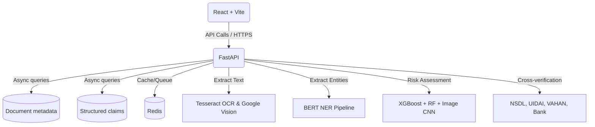

# IntelliShield — Insurance Fraud Detection Platform

## Overview
IntelliShield is a comprehensive, production-ready AI/ML web application designed to automate the ingestion, validation, and cross-checking of insurance claim documents to detect fraud. Built to comply with IRDAI Insurance Fraud Monitoring Framework Guidelines 2025.

## Architecture Architecture


## Setup Instructions

1. Configure environment variables:
   Copy `ai_shield/.env.example` to `ai_shield/.env` and update the placeholders with real credentials.

2. Run with Docker Compose:
   ```bash
   docker-compose up --build
   ```

3. Access the application:
   - Frontend: `http://localhost:3000`
   - Backend API Docs: `http://localhost:8000/docs`

## Dataset Instructions
Use `Insurance_Fraud_Dataset.xlsx` for model training. 
Execute `backend/ml_training/seed_db.py` to populate MongoDB with the 200 sample claims.
